# 🎓 StudentHub - Student Management System

StudentHub is a web-based Student Management System developed using **Django**, **Python**, **MySQL**, and **Bootstrap 5**. It provides secure authentication and enables users to efficiently manage student records through CRUD operations and search functionality.

---

## 🚀 Features

- User Registration & Login
- Secure Password Hashing
- Session-Based Authentication
- Student CRUD Operations
- Search Students by Course
- Responsive Bootstrap UI
- Django ModelForms
- Django Messages Framework
- REST APIs (Function-Based & Class-Based)
- MySQL Database Integration

---

## 🛠 Tech Stack

**Backend**
- Python
- Django
- Django REST Framework

**Frontend**
- HTML5
- CSS3
- Bootstrap 5
- Bootstrap Icons

**Database**
- MySQL

**Tools**
- VS Code
- Git
- GitHub
- Postman

---

# 📸 Project Screenshots

## 🏠 Home Page

| Screenshot 1 | Screenshot 2 |
|--------------|--------------|
| 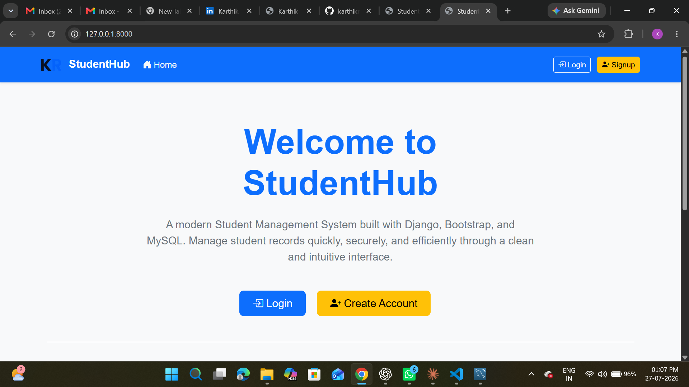 | 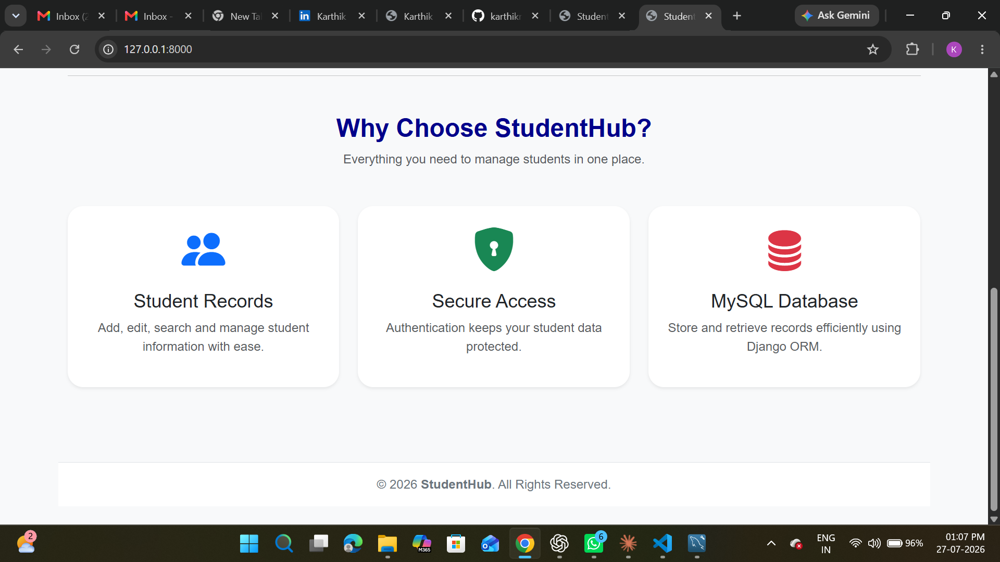 |

---

## 🔐 Login

| Screenshot 1 | Screenshot 2 |
|--------------|--------------|
| 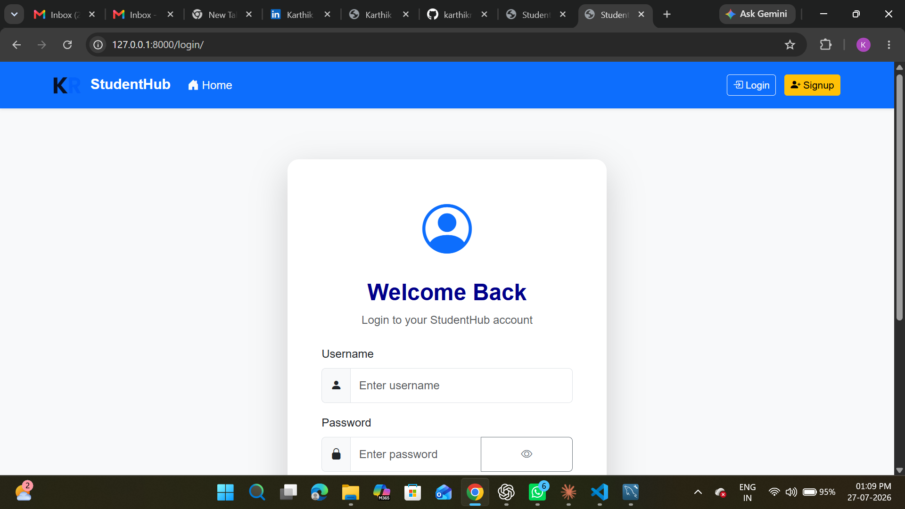 | 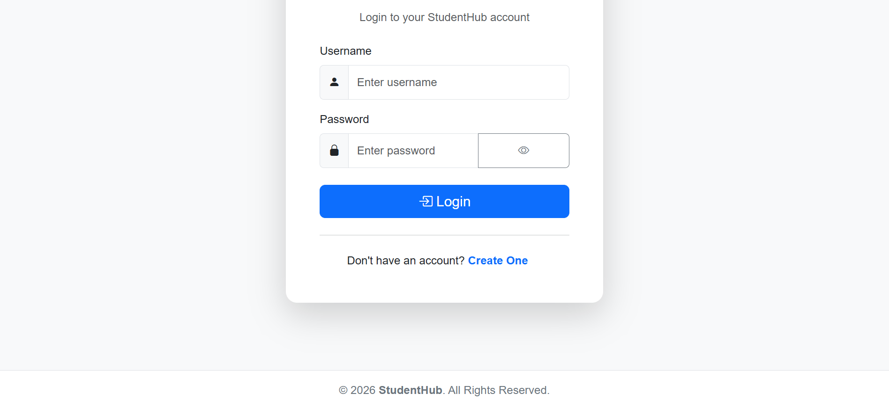 |

---

## 📝 Create Account

| Screenshot 1 | Screenshot 2 |
|--------------|--------------|
| 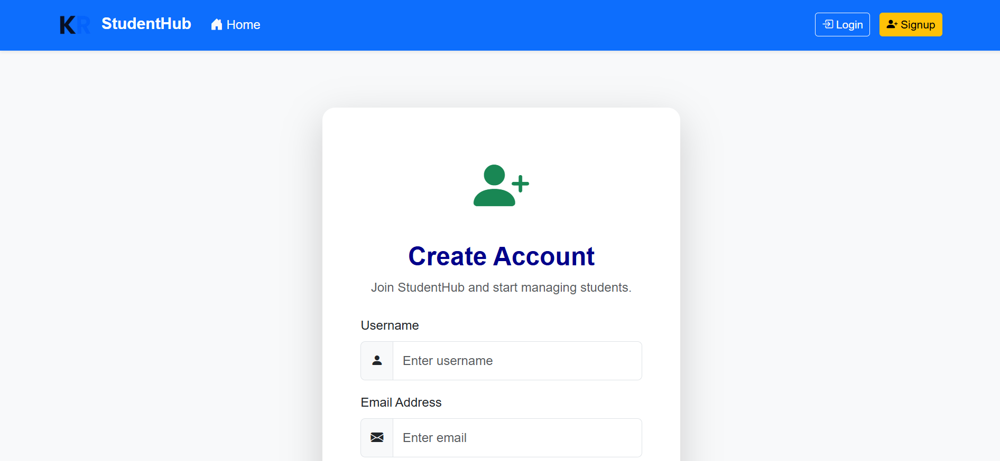 | 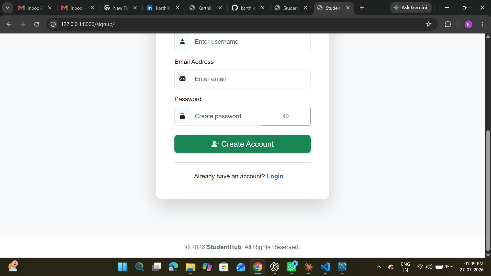 |

---

## 📋 Student Dashboard

| Screenshot 1 | Screenshot 2 |
|--------------|--------------|
| 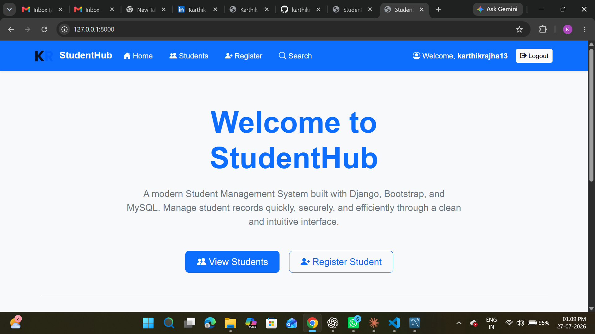 | 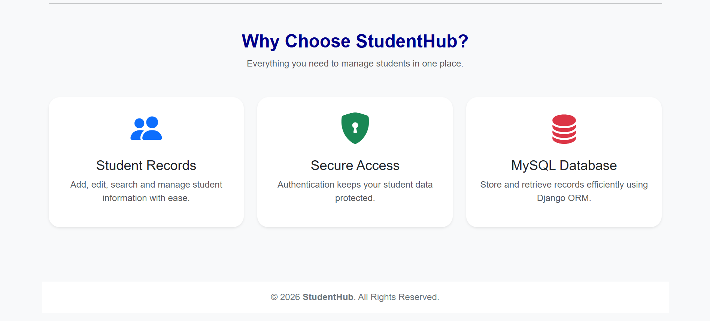 |

---

## ➕ Register Student

| Screenshot 1 | Screenshot 2 |
|--------------|--------------|
| 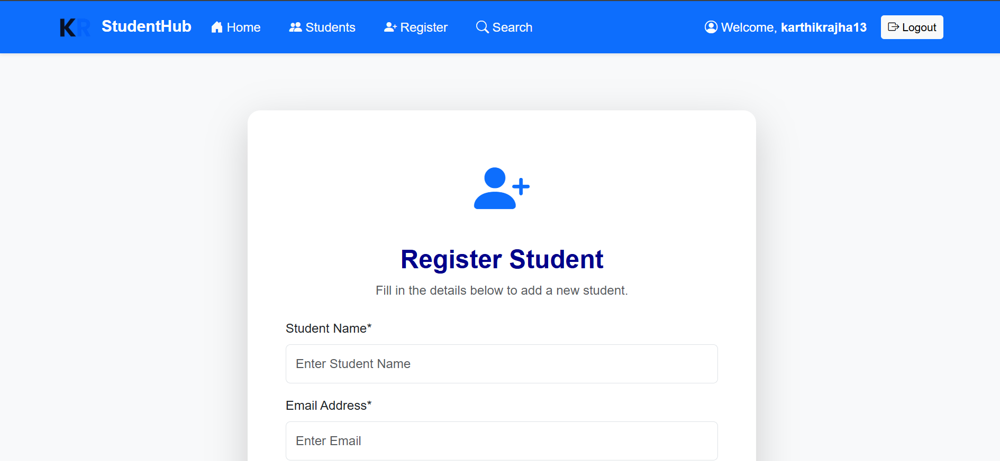 | 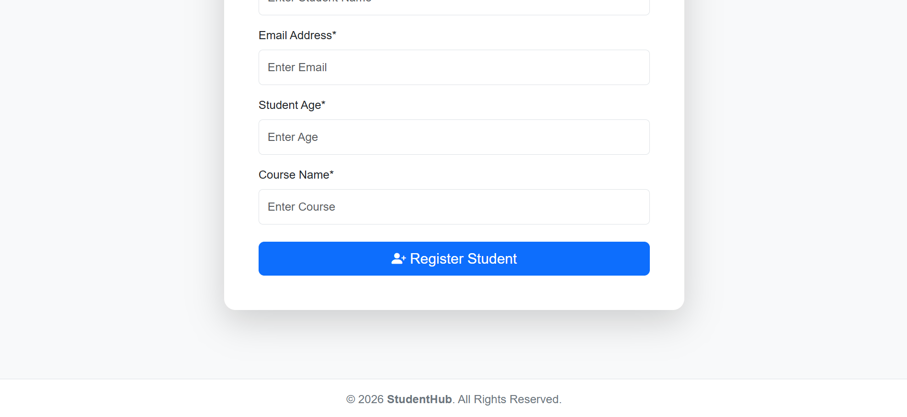 |

---

## ✏️ Edit Student

| Screenshot 1 | Screenshot 2 |
|--------------|--------------|
| 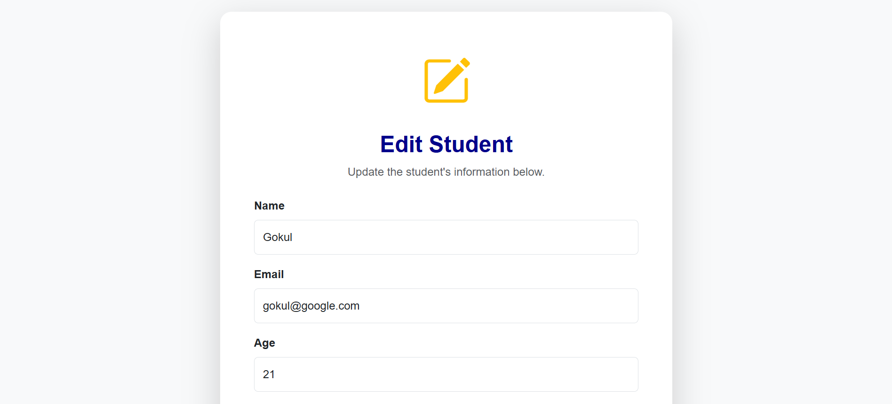 | 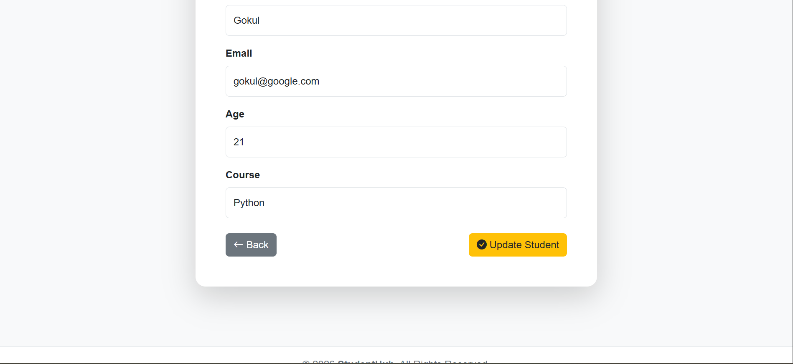 |

---

## 🗑 Delete Student

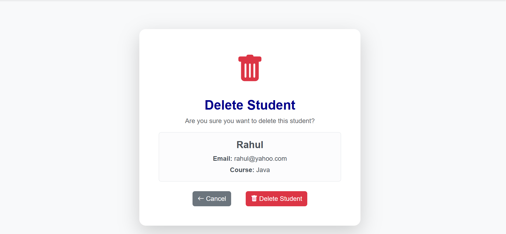

---

## 🔍 Search Student

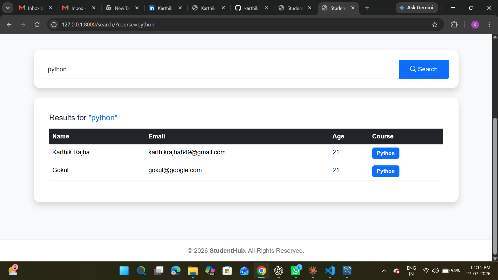

---

## 🔐 Authentication

- User Registration
- User Login
- User Logout
- Session Management
- Password Hashing (PBKDF2-SHA256)
- Protected Views using `@login_required`

---

## 🌐 REST APIs

- Function-Based API Views
- Class-Based API Views

---

## ⚙️ Installation

```bash
git clone https://github.com/karthikrajha13/studenthub-studentdbms

cd django-studentsdbms-project

python -m venv .venv

.\.venv\Scripts\activate

pip install -r requirements.txt

python manage.py migrate

python manage.py createsuperuser

python manage.py runserver
```

---

## 👨‍💻 Author

**Karthik Rajha R P**

- GitHub: https://github.com/karthikrajha13
- LinkedIn: https://www.linkedin.com/in/karthikrajha13/

---

## 📄 License

This project is developed for learning and portfolio purposes.